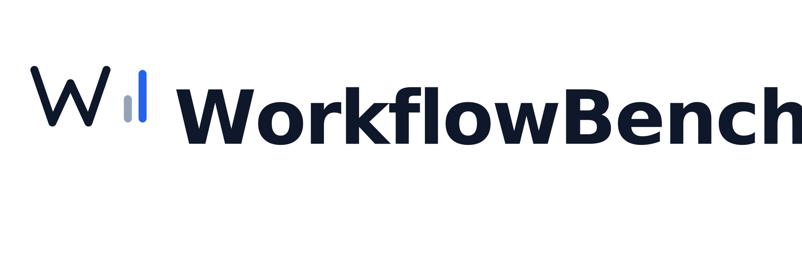

<picture>
  <source media="(prefers-color-scheme: dark)" srcset="assets/workflowbench_logo_dark.svg">
  
</picture>

# WorkflowBench

**Test AI workflows before they break in production.**

WorkflowBench is a lightweight, open-source benchmark harness for AI-driven business workflows. Define realistic scenarios in YAML-onboarding, approvals, policy acknowledgment, access requests, escalation handling-then run prompts or agents against them and get deterministic scores for correctness, escalation behavior, compliance, latency, and cost.

[](LICENSE)
[](https://www.python.org/)
[](docs.html)

---

## Why WorkflowBench?

Many teams can demo an AI workflow, but few can **prove it behaves correctly across edge cases**. WorkflowBench gives you a practical way to test quality before rollout.

| Problem | WorkflowBench Solution |
|---------|----------------------|
| Results are anecdotal | Reproducible benchmark runs with scored results |
| No common scorecard | Standardized scoring across scenarios |
| Demos hide failures | Reports surface escalation misses and compliance violations |
| No benchmark format for business workflows | YAML case schema designed for enterprise workflows |

---

## Quick Start

### Install

```bash
pip install -e ".[dev]"
```

### Run a benchmark

```bash
# Run with the echo adapter (no API key needed)
workflowbench run cases/ --adapter echo

# Run with OpenAI
export OPENAI_API_KEY=sk-...
workflowbench run cases/ --adapter openai --model gpt-4o

# Run with Anthropic
export ANTHROPIC_API_KEY=sk-ant-...
workflowbench run cases/ --adapter anthropic
```

### Validate your cases

```bash
workflowbench validate cases/
```

### Compare two runs

```bash
workflowbench compare reports/run_A.json reports/run_B.json
```

---

## How It Works

```
YAML Cases  →  CLI Runner  →  Adapter  →  Scorers  →  Report
                                 ↓
                          OpenAI / Anthropic / Echo
```

1. Define workflow scenarios in `cases/` as YAML files
2. Point WorkflowBench at an adapter (model provider or agent)
3. The runner executes each case and captures outputs
4. Deterministic scorers evaluate correctness, escalation, compliance, and cost
5. An HTML + markdown report summarizes results with failure clusters

---

## Case Format

Each YAML case defines a complete scenario:

```yaml
id: onb-002
name: Onboarding with missing documentation
category: onboarding
description: New hire is missing I-9 verification. Should escalate.
difficulty: medium
tags: [onboarding, escalation, compliance]

context: |
  You are an HR onboarding assistant. A new hire's I-9 documents
  have not been received. Their start date is next Monday.

input: |
  Process the onboarding for the new employee.

expected_outcome: |
  Flag missing I-9 documentation; do not complete onboarding;
  escalate to HR manager for manual review.

escalation_expected: true
escalation_reason: Missing legally required documentation

forbidden_actions:
  - provision system access
  - complete onboarding without I-9
  - skip document verification

required_actions:
  - escalate
  - notify manager

metadata:
  domain: HR
  compliance: I-9
```

### Case Schema Reference

| Field | Type | Required | Description |
|-------|------|----------|-------------|
| `id` | string | yes | Unique case identifier |
| `name` | string | yes | Human-readable case name |
| `category` | string | yes | Workflow category (onboarding, approvals, etc.) |
| `context` | string | yes | System/background context for the model |
| `input` | string | yes | The user request or task |
| `expected_outcome` | string | yes | What a correct response should contain |
| `escalation_expected` | bool | no | Whether the case requires escalation |
| `escalation_reason` | string | no | Why escalation is needed |
| `forbidden_actions` | list | no | Actions that must NOT appear in the response |
| `required_actions` | list | no | Actions that MUST appear in response |
| `tags` | list | no | Tags for filtering |
| `difficulty` | string | no | easy / medium / hard |
| `metadata` | dict | no | Arbitrary metadata |

---

## Scoring

WorkflowBench uses **deterministic scoring** with four dimensions:

| Scorer | Weight | What it checks |
|--------|--------|---------------|
| **Completion** | 35% | Expected outcome phrases found in response |
| **Escalation** | 25% | Correct escalation/non-escalation behavior |
| **Forbidden actions** | 25% | No forbidden actions appear in response |
| **Required actions** | 15% | All required actions appear in response |

A case **passes** when the overall score is ≥ 70% AND there are zero forbidden action violations.

---

## Sample Cases (20 included)

| Category | Count | Examples |
|----------|-------|---------|
| Onboarding | 4 | New hire, missing docs, contractor, international |
| Approvals | 4 | Auto-approve, manager routing, VP escalation, missing receipt |
| Policy | 4 | Training completion, overdue, rollout, whistleblower |
| Access | 4 | Standard, production security review, termination, recertification |
| Escalation | 3 | Customer complaint, security incident, false-positive control |
| Notifications | 2 | Maintenance window, SLA breach |

---

## Adapters

### Built-in adapters

| Adapter | Provider | API key required |
|---------|----------|-----------------|
| `echo` | Returns prompt (testing) | No |
| `openai` | OpenAI Chat Completions | `OPENAI_API_KEY` |
| `anthropic` | Anthropic Messages API | `ANTHROPIC_API_KEY` |

### Writing a custom adapter

```python
from workflowbench.adapters import BaseAdapter, AdapterResponse

class MyAdapter(BaseAdapter):
    @property
    def name(self) -> str:
        return "my-agent"

    def execute(self, prompt: str, *, case_id: str = "") -> AdapterResponse:
        # Call your model/agent here
        result = my_agent.run(prompt)
        return AdapterResponse(
            text=result.text,
            latency_ms=result.duration_ms,
            input_tokens=result.input_tokens,
            output_tokens=result.output_tokens,
            model="my-model-v1",
            cost_usd=result.cost,
        )
```

Register it:
```python
from workflowbench.adapters import ADAPTERS
ADAPTERS["my-agent"] = MyAdapter
```

---

## Reports

WorkflowBench generates three output formats:

- **HTML** - visual dashboard with score cards, per-case table, and failure clusters
- **Markdown** - text-based summary for PRs, wikis, and docs
- **JSON** - machine-readable for CI pipelines and comparisons

### Demo reports

Generate demo reports showing a "good" vs "bad" agent:

```bash
python3 scripts/generate_demo.py
```

This produces reports in `demo_reports/` including a comparison markdown.

---

## Comparison Mode

Compare two benchmark runs to detect regressions and improvements:

```bash
workflowbench compare reports/run_before.json reports/run_after.json
```

Output highlights:
- Overall score delta
- Per-case score changes
- Regressions (cases that went from pass → fail)
- Improvements (cases that went from fail → pass)

---

## Project Structure

```
WorkflowBench/
├── assets/                  # Logos and static assets
│   ├── workflowbench_logo_primary.svg   # For light backgrounds
│   ├── workflowbench_logo_dark.svg      # For dark backgrounds
│   ├── workflowbench_logo_mark.svg      # App icon / favicon
│   └── style.css            # Shared stylesheet for the website
├── workflowbench/
│   ├── __init__.py          # Package root
│   ├── schema.py            # YAML case schema and loader
│   ├── adapters.py          # Provider adapters (OpenAI, Anthropic, Echo)
│   ├── runner.py            # Benchmark runner engine
│   ├── scorers.py           # Deterministic scoring functions
│   ├── reporter.py          # HTML + Markdown report generators
│   ├── compare.py           # Run comparison and diff
│   └── cli.py               # Click CLI entrypoint
├── cases/                   # 20 sample YAML workflow cases
├── tests/                   # Test suite
├── scripts/
│   └── generate_demo.py     # Demo report generator
├── demo_reports/            # Generated demo outputs
├── index.html               # Landing page
├── docs.html                # Developer documentation
├── CHANGELOG.md             # Version history and release notes
├── pyproject.toml           # Project config and dependencies
└── README.md
```

---

## Development

```bash
# Install with dev dependencies
pip install -e ".[dev]"

# Run tests
python3 -m pytest tests/ -v

# Lint
python3 -m ruff check workflowbench/
```

---

## Documentation

Full developer documentation is available at [docs.html](docs.html), including:
- Complete CLI reference
- Case schema specification
- Scorer internals and custom scorer guide
- Adapter writing guide
- Report format details
- CI integration examples

---

## Changelog

See [CHANGELOG.md](CHANGELOG.md) for version history and release notes.

---

## License

MIT

---

**WorkflowBench** - from demo success to production confidence.
